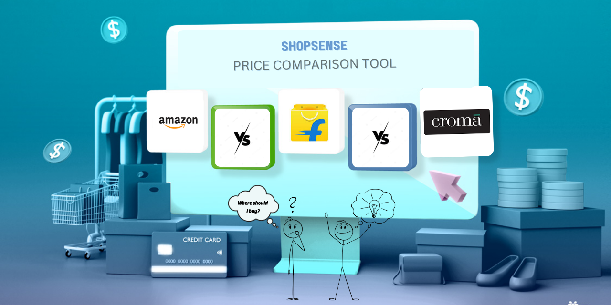

<h1 align="center">🛒 ShopSense - Product Price Comparison Tool</h1>

<p align="center">
    
    
    
    
    
    
    
    
</p>



## Introduction

**ShopSense** is an automated tool designed to compare product prices across multiple e-commerce platforms, empowering users to make smart purchasing decisions quickly and efficiently.

- Built using **Python**, **Flask**, and **Selenium**, ShopSense scrapes the web for product data, analyzes prices, and presents the best options at a glance.

> 💡 This tool can save users up to 80% of the time usually spent on manual price checking!

## Features

- **Real-Time Price Comparison**: Compares prices across various e-commerce websites like Amazon, eBay, Flipkart, Croma, and more.
- **Automated Web Scraping**: Uses Selenium for efficient, browser-based web scraping.
- **Data Analysis**: Utilizes Pandas to clean and analyze collected data for the best price evaluation.
- **Time Efficient**: Reduces manual work, providing results in minutes.
- **Email Notifications**: Sends email alerts when the price drops below a user-defined threshold.
- **Colored Logging**: Enhanced logging with color-coded messages for better readability.

## Tech Stack

- **Python** - Programming language
- **Flask** - Web framework
- **Selenium** - Browser automation tool
- **Colorlog** - Colored logging
- **Colorama** - Cross-platform colored terminal text

## Installation

1. **Clone the repository**:
   ```bash
   git clone https://github.com/Rambabu-Akkapolu/ShopSense.git
   ```
2. **Navigate to the project directory**:
   ```bash
   cd ShopSense
   ```
3. **Create and activate a virtual environment**:
   ```bash
   python -m venv venv
   venv\Scripts\activate  # On Windows
   source venv/bin/activate  # On macOS/Linux
   ```
4. **Install the required dependencies**:
   ```bash
   pip install -r requirements.txt
   ```
5. **Set up environment variables for email notifications**:
   ```bash
   # Create a .env file in the project root and add the following:
   EMAIL_USER=your_email@example.com
   EMAIL_PASS=your_email_password
   ```
6. **Usage**:
   1. **Run the Flask application**:

      ```bash
      python shop_sense.py
      ```
   2. **Access the application**: Open your web browser and go to http://127.0.0.1:5000.
   3. **Search for a product**: Enter the product name in the search bar and click "Search".
   4. **Set up price drop notifications**: Enter your desired price and contact email to receive notifications when the price drops.

**😊 If you like this project, please consider giving it a ⭐!**

⬆️ [Back to Top](#-shopsense---product-price-comparison-tool)
